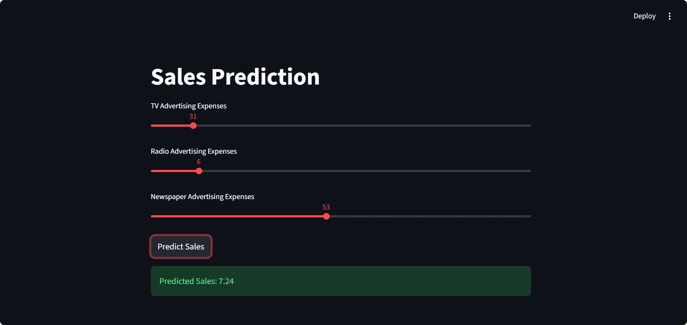

# 📊 Multiple Linear Regression – Sales Prediction

Predict **Sales** based on **TV**, **Radio**, and **Newspaper** advertising budgets using a **custom Multiple Linear Regression (MLR) model**. Includes a **Streamlit web app** for real-time interactive predictions.

---

## ✨ Project Badges

[](https://www.python.org/)  
[](https://streamlit.io/)  
[](https://github.com/SahilKaturde/multiple-linear-regression-sales-prediction/stargazers)

---

## 🧠 Overview & Model

This project demonstrates how advertising budgets affect sales using **Multiple Linear Regression**, trained via the **Normal Equation (closed-form solution)**.  

The model predicts **Sales** as a linear combination of advertising budgets:

$$
\hat{y} = \theta_0 + \theta_1 x_1 + \theta_2 x_2 + \theta_3 x_3
$$

Where:  
- $\hat{y}$ = Predicted Sales  
- $x_1$ = TV advertising spend  
- $x_2$ = Radio advertising spend  
- $x_3$ = Newspaper advertising spend  
- $\theta_0$ = Bias / Intercept  
- $\theta_1, \theta_2, \theta_3$ = Model coefficients  

---

### 🔢 Normal Equation (Closed-form Solution)

The optimal coefficients $\theta$ are computed as:

$$
\theta = (X^T X)^{-1} X^T y
$$

Where:  
- $X$ = Feature matrix (with a column of ones for the intercept)  
- $y$ = Target vector (Sales)  
- $X^T$ = Transpose of the feature matrix  

The predicted sales vector $\hat{y}$ is obtained as the **dot product** of the feature matrix and the coefficients:

$$
\hat{y} = X \cdot \theta
$$

This shows how each feature contributes linearly to the predicted sales.

---

## 📈 Visuals

### Actual vs Predicted Sales
Points close to the red dashed line ($y = x$) indicate accurate predictions.  


### Streamlit Application
Interactive interface for real-time predictions.  


---

## 📊 Model Performance & Metrics

- **Weights (including bias):** `[4.71412640e+00, 5.45092708e-02, 1.00945362e-01, 4.33664682e-03]`  
  ($\theta_0$ = bias/intercept, $\theta_1$ = TV, $\theta_2$ = Radio, $\theta_3$ = Newspaper)
- **R² Score:** 0.9059  
- **RMSE:** 1.7052  
- **MAE:** 1.2748  

These metrics indicate that the model fits the data well and predicts sales with high accuracy.

---

## 🚀 How to Run Locally

1. **Clone the repository:**
```bash
git clone https://github.com/SahilKaturde/multiple-linear-regression-sales-prediction.git
cd multiple-linear-regression-sales-prediction
